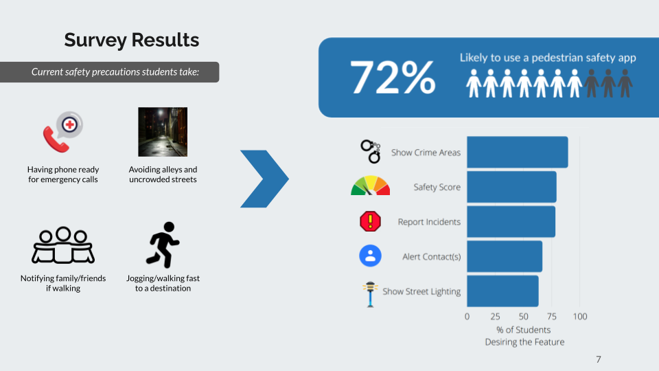
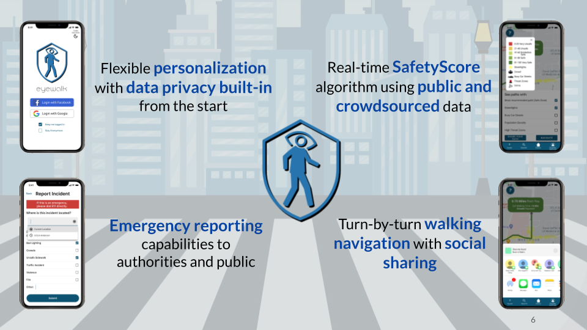
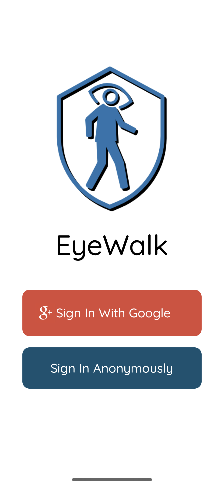
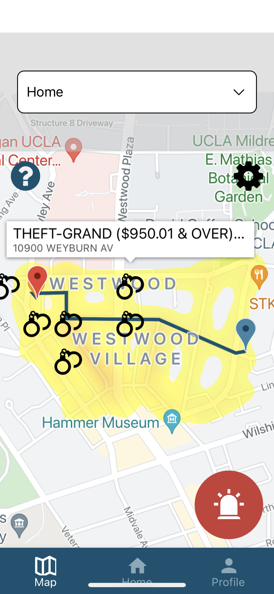
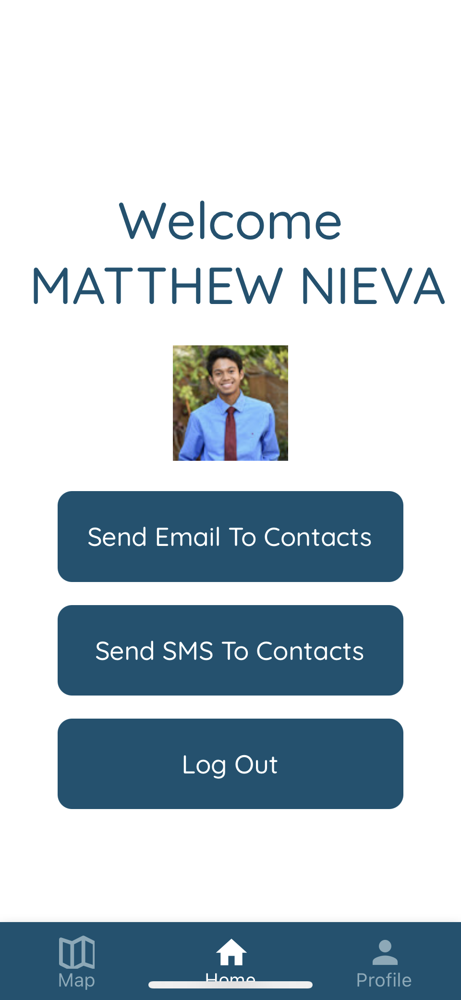
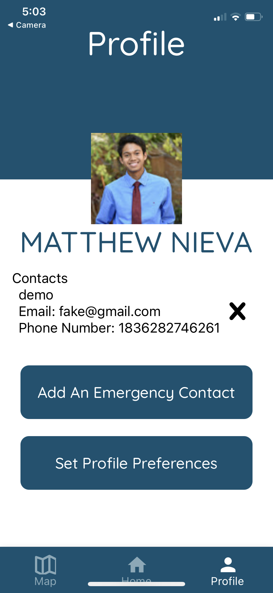

# EyeWalk

YTP Spring 2021: Cyber Citizens Source Code for EyeWalk

After analyzing our survey results of what users wanted for a pedestrian survey app, we have taken the first steps necessary into making EyeWalk a reality!

## Our Results

## EyeWalk's Key Features

## Our Solution

EyeWalk is our full-stack mobile application built to be a proactive solution to feeling unsafe while walking in urban cities.

## EyeWalk In Action

### Signing In Via Google Or Anonymously

### Viewing The Map And Routing

### Home Screen To Notify Contacts

### Profile Screen

